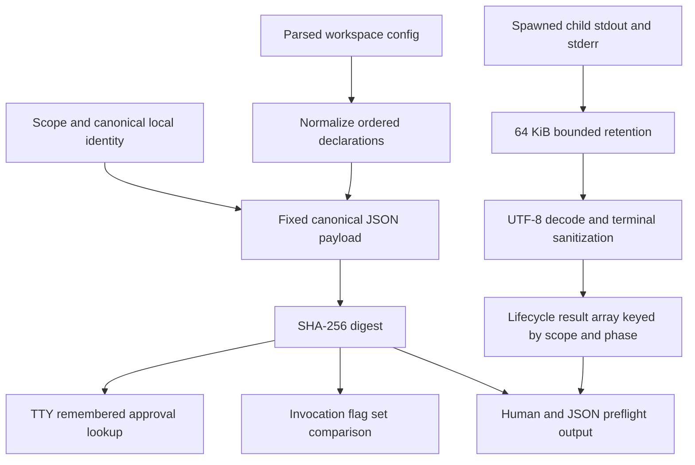

# Workspace Runtime Prerequisites - Plan

## Goal Capsule

- **Objective:** A workspace can install reviewed runtime prerequisites before artifact sync without silently executing project-controlled commands or weakening plugin source integrity.
- **Means:** Retain `lifecycleHooks.preSync` as a general arbitrary-script escape hatch, add content-addressed user trust and a hardened process runner, and add `expectedSha` beside symbolic plugin pins. (KTD1, KTD2, KTD7)
- **Authority:** The requirements and key decisions in this plan override the current draft implementation. Current `main` conventions and security boundaries override implementation convenience.
- **Execution profile:** Two staged PRs. Harden and independently security-review draft PR #430 first. Merge it before rebasing and updating PR #454.
- **Stop conditions:** Stop before production implementation if #430 is not rebased onto current `origin/main`, external Workmux release evidence cannot be reverified, or any sync entry point can execute unapproved scripts.
- **Tail ownership:** #430 owns the lifecycle, trust, source-integrity, tests, docs, changelog, and generic example. #454 owns the final engineering workspace declaration and its 40-skill validation.

---

## Product Contract

### Summary

Finish draft PR #430's `lifecycleHooks.preSync` feature as a safe, general escape hatch for runtime prerequisites such as Workmux, `agent-tui`, and `bd`.
The feature must preserve ordered required and optional scripts, dry-run behavior, and human and JSON output while replacing immediate execution with explicit content-addressed approval.
The same change adds commit verification for symbolically pinned plugin sources so a workspace can install an immutable Workmux `skills/` subtree without attempting an unsupported raw-SHA `--branch` clone.

### Problem Frame

PR #430 currently parses project-controlled shell text and executes it immediately through `sh -c` with the full parent environment.
The draft has no trust decision, inherits credentials, buffers without a documented bound, reports timeouts and signals as generic exit failures, and syncs user scope before project scope has been preflighted.
A malicious or replaced workspace config can therefore run commands before the user sees the sync result.

The engineering workspace in PR #454 needs both a Workmux binary and six Workmux skills.
A Workmux-specific package manager would narrow the immediate risk but would not solve the same prerequisite need for other CLIs.
The maintained design keeps the escape hatch and makes the trust boundary explicit.

### Key Decisions

- **Keep the arbitrary-script lifecycle escape hatch.** (session-settled: user-directed — chosen over a Workmux-specific package manager: one hardened mechanism remains useful for Workmux, agent-tui, bd, and future CLI prerequisites.) Governs R1-R11.
- **Install Workmux for the user, not inside a workspace.** Future agent processes need a binary available through their normal `PATH`; workspace-local path changes do not propagate to those processes. Governs R18-R22.
- **Install only the Workmux skills subtree.** The engineering workspace needs six skills and must not install the `.claude-plugin/workmux-status` hooks. Governs R19-R21.

### Requirements

**Lifecycle compatibility**

- R1. Preserve the `lifecycleHooks.preSync` schema with string shorthand and `{ name, script, optional }` object declarations.
- R2. Execute declarations in source order, stop after a required failure, continue after an optional failure, and run all hooks before managed repositories, plugin validation, purge, copy, generated files, MCP changes, native installs, sync-state writes, or schema migrations mutate a workspace.
- R3. Preflight every configured scope before any scope begins sync mutation; the established execution order remains user scope followed by project scope after all scopes pass preflight.
- R4. Dry-run must show every normalized declaration and planned execution context without prompting, reading or writing trust, or starting a process.

**Content-addressed trust**

- R5. Compute a lowercase SHA-256 digest over the complete ordered normalized `preSync` declarations and canonical workspace identity using the canonicalization in KTD2.
- R6. Store remembered approvals only in the user-local AllAgents state at `~/.allagents/lifecycle-trust.json`; project-controlled `.allagents/` content must never grant trust.
- R7. On first use or digest change, an interactive TTY must show scope, canonical workspace root, canonical config path, invocation cwd, execution cwd, digest, required/optional status, and exact escaped script text before asking `Approve and remember this exact lifecycle digest? [y/N]`.
- R8. Interactive approval defaults to No; a decline, unreadable trust store, invalid trust-store schema, or changed preflight snapshot aborts before script or sync mutation with exit code 2.
- R9. JSON mode and any non-TTY invocation must ignore remembered approval and fail closed with exit code 2 unless each pending digest is supplied by a repeatable `--approve-lifecycle <sha256>` flag.
- R10. A flag-provided digest authorizes only the current invocation and is never persisted; a bare boolean, unknown digest, malformed digest, duplicate digest, or missing digest is rejected with exit code 2.
- R11. A script, declaration order, `name`, `optional` value, canonical workspace identity, config symlink target, or scope change must produce a different digest and require a new approval.

**Execution hardening**

- R12. Run each approved script with stdin closed, the minimal environment in KTD4, a 120-second timeout, bounded stdout and stderr, terminal-safe output, and process-tree termination.
- R13. Report success, nonzero exit, signal termination, timeout, output truncation, duration, and required/optional continuation exactly in human and JSON output.
- R14. AllAgents must not provide `sudo`, elevate privileges, install OS packages, or claim to sandbox the script; approval covers arbitrary commands that can mutate the workspace and the user's home directory.

**Plugin source integrity**

- R15. Add optional plugin object field `expectedSha`, normalized to lowercase and restricted to exactly 40 hexadecimal characters.
- R16. `expectedSha` requires a symbolic tag or branch pin; a raw 40-hex `pin`, a missing pin, a non-GitHub source, or a mismatch between object `pin` and an embedded `/tree/<ref>/` source is a configuration error.
- R17. Verify the fetched or offline cached repository `HEAD` equals `expectedSha` before resolving a subpath, reading manifests, discovering skills or hooks, or copying artifacts; a mismatch is exit code 1 and leaves workspace artifacts unchanged.

**Workmux integration**

- R18. The generic lifecycle example must contain a real, idempotent macOS/Linux Workmux installer for x64 and arm64 that uses only direct assets for one pinned release and literal per-platform SHA-256 values.
- R19. The Workmux plugin source must resolve to the pinned `skills/` subtree and use the exact allowlist `workmux`, `worktree`, `coordinator`, `merge`, `rebase`, and `open-pr` with the matching release tag and `expectedSha`.
- R20. The installer must require Git, one of `tmux`, `zellij`, `kitty`, or `wezterm`, a downloader, a SHA-256 tool, `tar`, and an existing `~/.local/bin` entry in `PATH` before download; missing `gh` is a warning that PR functionality is reduced.
- R21. The installer must use a private temporary directory, reject unsupported platforms and unsafe archives, verify the embedded checksum, stage and verify the new binary, atomically replace `~/.local/bin/workmux`, roll back on post-replacement failure, and always clean temporary files.
- R22. Exact installed version `0.1.246` is a no-download success; the declaration must never resolve `latest`, run a mutable `main` installer, use `curl | sh`, Cargo, Homebrew, or `sudo`, and must not upgrade automatically.

**Compatibility, delivery, and maintenance**

- R23. Existing users of the current draft receive no implicit grandfathering: their next interactive run requests approval, while JSON and non-TTY automation must add the exact digest flag.
- R24. Update every direct sync entry point, shared formatter, agent-help metadata, docs, changelog, examples, and tests in the same #430 cutover; do not leave an unsafe legacy runner or output shape.
- R25. After #430 passes independent security review and merges, rebase #454, add the six Workmux skills and installer declaration, keep Compound `ce-worktree` disabled, and validate exactly 40 enabled skills.

### Acceptance Examples

- AE1. Covers R5-R8. Given a new project config with one required script, an interactive update shows the complete approval panel and defaults to decline; declining creates neither a marker nor a trust entry and exits 2.
- AE2. Covers R6, R7, R11. Given a remembered project digest, changing only an unrelated plugin allowlist preserves trust; changing script text, order, name, optionality, root identity, config symlink target, or scope invalidates it.
- AE3. Covers R9-R10. Given trusted content and `--json`, update still exits 2 without `--approve-lifecycle <exact-digest>`; supplying every exact pending digest executes without prompting and does not modify the trust store.
- AE4. Covers R4. Given untrusted user and project hooks, dry-run lists both scopes and all scripts, returns success, and performs no prompt, trust access, process start, or sync mutation.
- AE5. Covers R2-R3. Given valid user hooks and an unapproved project hook, update executes neither scope and changes no sync-managed file.
- AE6. Covers R11. Invoking the same project through a symlink to the same real root reuses trust; retargeting that symlink produces a new digest. A remote `init --from` config is approved only for the resulting local target identity.
- AE7. Covers R8, R11. If `workspace.yaml` content or its resolved path changes after preflight, execution aborts with exit 2 even when the previously computed digest was approved.
- AE8. Covers R12-R13. A script that forks a child and exceeds 120 seconds receives tree-wide termination; JSON reports `status: "timed_out"`, `timedOut: true`, `exitCode: null`, and any final signal without leaving a child process.
- AE9. Covers R12-R13. Output containing ANSI, OSC, C0 control bytes, or more than 64 KiB per stream is safe to print and reports truncation without unbounded memory growth.
- AE10. Covers R15-R17. A tagged plugin whose fetched `HEAD` differs from `expectedSha` fails before skill or hook discovery and before any destination is purged or copied.
- AE11. Covers R18-R22. In a disposable HOME on each supported fixture platform, a valid Workmux archive installs atomically, reports `workmux 0.1.246`, and a second run performs no download.
- AE12. Covers R19, R25. Syncing the pinned Workmux `skills/` subtree installs exactly six skills, installs no `workmux-status` hook, and the rebased engineering workspace resolves exactly 40 skills with Compound `ce-worktree` absent.

### Success Criteria

- No project-controlled script can run from any CLI, TUI, init, plugin, skill, or direct sync path without a matching interactive or invocation-scoped content digest decision.
- A required hook failure or approval failure leaves every AllAgents-managed destination and sync-state file unchanged.
- Workmux is reproducibly installed from a reviewed immutable asset set and its skills resolve from a commit-verified subtree.
- A reviewer can reproduce the final 40-skill engineering workspace without consulting this session.

### Scope Boundaries

#### In scope

- One lifecycle phase: `preSync`.
- Project and user workspace scopes.
- POSIX shell execution compatible with the current `sh -c` contract.
- Content-addressed trust, process hardening, exact output contracts, plugin commit verification, Workmux example integration, migration guidance, tests, docs, changelog, and staged PR delivery.

#### Deferred to Follow-Up Work

- PR #454 adds the final engineering declaration only after #430 merges. It consumes the #430 API and does not duplicate trust or installer logic in AllAgents production code.

#### Outside this product's identity

- A general dependency solver, package registry, package manager, or OS package installer.
- Automatic installation of Git, tmux, Zellij, Kitty, WezTerm, `gh`, download tools, archive tools, or checksum tools.
- Script sandboxing, capability inference, command-by-command approval, privilege elevation, or supplied `sudo` credentials.
- Automatic prerequisite upgrades, mutable release selection, or background execution.
- Uninstalling a user binary when a prerequisite declaration is removed.
- Windows Workmux binary installation. Lifecycle execution remains compatible with environments that provide `sh`, but the example rejects non-macOS/Linux platforms before download.

### Dependencies

- Draft PR #430 at `4c85aec118456761748bdc784d8529359ef4bb72`.
- Current `origin/main` baseline observed on 2026-08-24 at `2b43d4b` (`fix(docs): standardize builds on Bun (#456)`).
- PR #454's engineering workspace, currently 34 skills: 24 Compound, 9 Matt Pocock, and 1 Hermes.
- Workmux release evidence in KTD8. It is an implementation input, not permanent authority; implementation must reverify it before editing production or example declarations.

---

## Planning Contract

### Rebase Baseline

PR #430 starts 32 commits behind and 2 commits ahead of `origin/main`.
Rebase it before any production implementation.
The two PR commits are `002ecc5` (`feat(workspace): add lifecycle hooks for runtime prerequisites`) and `4c85aec` (`fix: preserve lifecycleResults in no-clients early return, remove unused test imports`).

A merge-tree simulation against `origin/main` was clean, but three files changed on both sides and are conflict-prone during commit-by-commit rebase:

- `src/models/workspace-config.ts` — preserve main's `PluginEntrySchema`, `getEffectivePluginSource`, pin behavior, and current client/schema additions while restoring the lifecycle schemas.
- `src/core/sync.ts` — preserve main's marketplace access checks, relocated hook handling, source provenance, warnings, and current user/project sync behavior while reintroducing lifecycle preparation and results.
- `docs/src/content/docs/docs/reference/configuration.mdx` — preserve current plugin object syntax and all post-#430 reference changes while replacing the draft's unsafe lifecycle guidance.

After rebase, compare the complete ten-file PR surface, not only conflict markers: `docs/src/content/docs/docs/reference/configuration.mdx`, `examples/workspaces/lifecycle-hooks/.allagents/workspace.yaml`, `examples/workspaces/lifecycle-hooks/README.md`, `src/cli/commands/workspace.ts`, `src/cli/format-sync.ts`, `src/core/lifecycle-scripts.ts`, `src/core/sync.ts`, `src/models/workspace-config.ts`, `tests/unit/core/lifecycle-scripts.test.ts`, and `tests/unit/core/sync-lifecycle.test.ts`.

### Key Technical Decisions

- KTD1. **Use digest approval, not command classification.** (session-settled: user-directed — chosen over a Workmux-specific package manager: approving exact arbitrary content preserves the escape hatch without pretending AllAgents can prove a shell script safe.) Implements R1-R11.
- KTD2. **Canonicalize one fixed JSON payload.** Normalize each string or object declaration to `{ "name": <exact parsed string>, "script": <exact parsed string>, "optional": <boolean> }`. Hash UTF-8 bytes of whitespace-free `JSON.stringify` output with fixed insertion order: `schema`, `scope`, `workspaceRoot`, `configPath`, `scripts`. Set `schema` to `allagents.lifecycle.preSync/v1`. Canonical paths use `realpath`, normalized separators, no non-root trailing separator, Unicode NFC, and a lowercase Windows drive letter. The SHA-256 output is 64 lowercase hexadecimal characters. Implements R5, R11.
- KTD3. **Bind trust to semantic script content and local identity, not unrelated config bytes.** A regular config replacement at the same canonical path keeps trust only when the normalized declarations are unchanged. A symlink alias to the same target shares trust. Retargeting the workspace or config symlink changes identity. `init --from` grants no trust to a remote URL; approval occurs after copy against the target's canonical local identity. Capture the raw config SHA-256, canonical paths, file type, device, and inode during preflight and verify them immediately before execution to close the in-process replacement window. Implements R7, R11.
- KTD4. **Use an allowlist environment.** Child environment contains only `HOME`, a controlled `PATH`, `LANG=C`, `LC_ALL=C`, `ALLAGENTS_WORKSPACE`, and `ALLAGENTS_CONFIG_DIR`. Set `HOME` from `getHomeDir()` and set both AllAgents paths from the prepared canonical identity; none are config-supplied. Build `PATH` from parent entries only after rejecting empty, relative, workspace-contained, config-contained, duplicate, non-directory, and world-writable entries. Inheritance of all other variables is prohibited, which removes `GH_TOKEN`, `GITHUB_TOKEN`, `SSH_AUTH_SOCK`, `SSH_AGENT_PID`, `AWS_*`, `AZURE_*`, `GOOGLE_*`, `NPM_TOKEN`, `NODE_AUTH_TOKEN`, `PYPI_TOKEN`, `CARGO_REGISTRY_TOKEN`, `HOMEBREW_GITHUB_API_TOKEN`, proxy credentials, and unknown future credentials by default. Implements R12.
- KTD5. **Stream with bounded retention and explicit process state.** Replace `execFile` with `spawn`; close stdin, drain both streams, retain the first 32 KiB and last 32 KiB of each, and set the corresponding truncation flag after 64 KiB. Decode with replacement for invalid UTF-8. Normalize CRLF/CR to LF. Remove ANSI CSI, OSC, DCS, APC, and PM sequences and C0/C1 controls except newline and tab before any terminal or JSON rendering. Implements R12-R13.
- KTD6. **Kill the whole process tree.** On POSIX, start a detached process group, send `SIGTERM` to the negative pid at 120 seconds, wait two seconds, send `SIGKILL`, and reap the child. Where `sh` is available on Windows, use `taskkill /T /F` for the child tree. Report the observed exit code, signal, and timeout independently instead of translating every error to exit 1. Implements R12-R13.
- KTD7. **Prepare, authorize, then execute.** Introduce immutable prepared-sync objects for user and project scopes. Preparation reads and validates config, computes identity and digest, and records the snapshot without migration or sync mutation. The CLI/TUI coordinator prepares all participating scopes, resolves every approval, verifies every snapshot, and persists all new interactive approvals in one atomic trust-store update only after every pending digest is accepted; one decline stores none. It then executes approved scripts in user-then-project order and enters each existing sync body only after all required hooks permit it. Direct core callers default to non-interactive authorization, never implicit trust. Implements R2-R4, R8-R10.
- KTD8. **Use `expectedSha` as a second factor beside a symbolic ref.** Keep the current `pin`/embedded tree-ref transport because `src/core/git.ts:cloneTo` passes it to `git clone --branch`. Carry `expectedSha` through `buildPluginSyncPlans`, `validateAllPlugins`, and `validatePlugin`; require every successful fetch path, including offline and seeded cache hits, to return the actual `HEAD`; compare before deriving `parsed.subpath`. Implements R15-R17.
- KTD9. **Use Workmux v0.1.246 as the reviewed plan default, subject to mandatory re-verification.** Evidence captured 2026-08-24: tag `v0.1.246`; commit `6264c85f81483d86b2643271f6850b94be359e2b`; release published 2026-08-24; release metadata reports `immutable: false`; commit signature status is unverified. The implementation agent must confirm the tag still resolves to that commit, all four asset digests still match, every asset downloads over HTTPS, and the six skill names and subtree still match before coding. A mismatch stops implementation and requires updating this plan and review evidence rather than silently selecting another release. Implements R18-R22.
- KTD10. **Treat CLI approval as a global repeatable value flag.** Parse `--approve-lifecycle <sha256>` before `cmd-ts`, like `--json` and `--jq`, so every command path that can auto-sync can carry one or more digests. Reject `--approve-lifecycle` without a value, `--approve-lifecycle=<empty>`, malformed values, duplicates, and values not present in the current preflight. Implements R9-R10, R24.

### High-Level Technical Design

#### Authorization and sync sequence

```mermaid
sequenceDiagram
  participant Caller as CLI or TUI caller
  participant Prepare as Sync preflight
  participant Trust as User trust store
  participant Runner as Lifecycle runner
  participant Sync as Existing sync body

  Caller->>Prepare: prepare user and project scopes
  Prepare-->>Caller: immutable snapshots and pending digests
  alt dry-run
    Caller-->>Caller: render every would-execute action
  else interactive TTY
    Caller->>Trust: read remembered approvals
    Caller-->>Caller: prompt once per untrusted digest, default No
  else JSON or non-TTY
    Caller-->>Caller: require every exact flag digest
  end
  Caller->>Prepare: verify config and identity snapshots unchanged
  Caller->>Runner: execute approved user hooks, then project hooks
  alt required hook fails
    Runner-->>Caller: exact failure; no sync mutation
  else hooks pass or optional hooks fail
    Caller->>Sync: run user sync, then project sync
  end
```

#### Approval state machine

```mermaid
stateDiagram-v2
  [*] --> Prepared
  Prepared --> DryRun: dry-run
  Prepared --> Approved: matching TTY trust
  Prepared --> Prompted: interactive and untrusted
  Prepared --> Approved: prompt Yes
  Prompted --> Refused: prompt No or EOF
  Prepared --> Approved: non-TTY plus every exact flag digest
  Prepared --> Refused: JSON or non-TTY missing or mismatched digest
  Approved --> Stale: config or identity snapshot changed
  Approved --> Executing: snapshot unchanged
  Executing --> Failed: required exit, signal, or timeout
  Executing --> SyncReady: all required scripts pass
  DryRun --> [*]
  Refused --> [*]
  Stale --> [*]
  Failed --> [*]
  SyncReady --> [*]
```



#### Trust and output data flow



### Core Sync API Contract

`src/core/sync.ts` owns these exported types and entry points after the clean cutover:

```ts
type SyncScope = 'user' | 'project';
type LifecycleAuthorizationSource = 'remembered' | 'interactive' | 'flag';

interface LifecycleAuthorization {
  digest: string;
  source: LifecycleAuthorizationSource;
}

interface PreparedSyncBatch {
  scopes: readonly PreparedSyncScope[];
  lifecycleHooks: readonly PreparedLifecycleHook[];
  dryRun: boolean;
}

prepareConfiguredSyncScopes(input: {
  projectWorkspacePath?: string;
  includeUser: boolean;
  syncOptions: SyncOptions;
}): Promise<PreparedSyncBatch>;

executePreparedSyncBatch(
  prepared: PreparedSyncBatch,
  authorizations: readonly LifecycleAuthorization[],
): Promise<SyncBatchResult>;
```

`PreparedSyncScope` and `PreparedLifecycleHook` expose readonly output fields but keep the validated config and stat snapshot module-private.
`prepareConfiguredSyncScopes` deduplicates the user config, prepares user before project, and performs no trust access, lifecycle execution, schema migration, plugin fetch, or sync mutation.
`executePreparedSyncBatch` accepts only digests present in the prepared batch, rejects missing or extra values with a typed `LifecycleAuthorizationError`, revalidates every snapshot, executes all lifecycle hooks, and then invokes the existing single-scope mutation bodies.
For dry-run it rejects nonempty authorizations, returns `would_execute` results, and never calls trust or process APIs.

Keep `syncWorkspace` and `syncUserWorkspace` as supported single-scope entry points because existing core tests and integrations use them, but add `SyncOptions.lifecycleAuthorizations?: readonly LifecycleAuthorization[]`.
Each wrapper prepares its own one-scope batch and fails closed with `LifecycleAuthorizationError` when hooks exist without the exact digest.
All repository commands and TUI actions that can involve both scopes must use the batch API, not call the wrappers sequentially.
`LifecycleAuthorizationError.code` is one of `LIFECYCLE_APPROVAL_REQUIRED`, `LIFECYCLE_APPROVAL_REFUSED`, `LIFECYCLE_APPROVAL_INVALID`, `LIFECYCLE_TRUST_UNSAFE`, or `LIFECYCLE_PREFLIGHT_CHANGED`; the CLI maps every value to exit 2 and the JSON `data.errorCode` field.

### Trust Store Contract

Path: `~/.allagents/lifecycle-trust.json` under the directory returned by `getAllagentsDir()`.
Create `~/.allagents` with mode `0700` when absent; require the state directory and trust file to be owned by the current user, reject a symlinked state directory, and reject group/world-writable state directories.
Reject a symlink, non-regular trust file, or trust file with group/other permission bits.
Read and write the file with mode `0600`, a same-directory exclusive temporary file, fsync, atomic rename, and no symlink following where the platform supports `O_NOFOLLOW`.
A corrupt file or unsupported version fails closed; do not reset it automatically.

```json
{
  "version": 1,
  "approvals": {
    "<64-lowercase-hex-digest>": {
      "canonicalization": "allagents.lifecycle.preSync/v1",
      "scope": "project",
      "workspaceRoot": "/canonical/workspace",
      "configPath": "/canonical/workspace/.allagents/workspace.yaml",
      "scripts": [
        {
          "name": "install-workmux",
          "script": "exact parsed shell text",
          "optional": false
        }
      ],
      "approvedAt": "2026-08-24T00:00:00.000Z"
    }
  }
}
```

The map key must equal a fresh digest of the stored canonical fields.
Ignore neither a mismatch nor an invalid entry; fail the trust read so tampering cannot downgrade to an implicit prompt-and-run path.
Do not update `approvedAt` or add last-used timestamps during ordinary execution.

### CLI, Human Output, and Exit Contract

Accepted commands include all current aliases and any auto-syncing command because the flag is extracted globally:

```bash
allagents update --approve-lifecycle <sha256>
allagents workspace update --approve-lifecycle <sha256>
allagents workspace sync --approve-lifecycle <sha256>
allagents init --from <source> --approve-lifecycle <sha256>
allagents update --approve-lifecycle <user-sha256> --approve-lifecycle <project-sha256> --json
```
Both `--approve-lifecycle <sha256>` and `--approve-lifecycle=<sha256>` are accepted and repeatable; human help presents the space-separated canonical form. A non-TTY text failure prints each pending scope and digest plus the exact repeatable flags needed for a rerun; it never prompts or persists approval.

Interactive first-use panel, with control characters escaped as `\u00NN` and every script line preserved:

```text
Lifecycle approval required
Scope: project
Workspace: /canonical/workspace
Config: /canonical/workspace/.allagents/workspace.yaml
Invocation cwd: /path/from/which/allagents/was/run
Execution cwd: /canonical/workspace
Digest (SHA-256): <64-lowercase-hex>
Scripts, in execution order:
  1. [required] install-workmux
     ----- script -----
     <exact escaped script text>
     ----- end script -----
Warning: These arbitrary commands can modify the workspace and your home directory.
AllAgents does not sandbox them, install OS packages, provide sudo, or elevate privileges.
Approve and remember this exact lifecycle digest? [y/N]
```

Human result lines use these exact state words: `approved`, `trusted`, `would execute`, `succeeded`, `failed (exit N)`, `terminated (SIGNAL)`, `timed out (120s)`, `not run after required failure`, and `optional failure; continuing`.
Dry-run prints the same scope, identity, digest, cwd, declaration order, required/optional marker, and exact escaped script blocks with action `would execute`.

Exit codes:

| Code | Meaning |
|---|---|
| `0` | Dry-run completed, or every required hook and sync operation succeeded; optional hook failures may be present and are warnings. |
| `1` | Required script exit/signal/timeout, `expectedSha` mismatch, plugin validation failure, or an existing sync failure. |
| `2` | Approval required or declined, malformed/missing/unknown approval digest, trust-store safety failure, changed preflight snapshot, or CLI usage error. |

### JSON Contract

`buildSyncData` exposes lifecycle results as an array so user and project `preSync` entries cannot overwrite one another during `mergeSyncResults`.
The approval-required envelope keeps the existing string `error` contract and adds machine-readable data:

```json
{
  "success": false,
  "command": "workspace sync",
  "error": "Lifecycle approval required",
  "data": {
    "errorCode": "LIFECYCLE_APPROVAL_REQUIRED",
    "lifecycleHooks": [
      {
        "scope": "project",
        "phase": "preSync",
        "workspace": "/canonical/workspace",
        "config": "/canonical/workspace/.allagents/workspace.yaml",
        "cwd": "/canonical/workspace",
        "digest": "<64-lowercase-hex>",
        "action": "approval_required",
        "authorization": "none",
        "success": false,
        "scripts": [
          {
            "index": 0,
            "name": "install-workmux",
            "script": "exact parsed shell text",
            "optional": false,
            "action": "not_run",
            "status": "not_run",
            "exitCode": null,
            "signal": null,
            "timedOut": false,
            "durationMs": 0,
            "stdout": "",
            "stderr": "",
            "stdoutTruncated": false,
            "stderrTruncated": false
          }
        ]
      }
    ]
  }
}
```

Successful and dry-run envelopes use the same object shape.
Allowed lifecycle `action` values are `approval_required`, `would_execute`, and `executed`.
Allowed script `action` values are `would_execute`, `executed`, and `not_run`.
Allowed script `status` values are `dry_run`, `succeeded`, `failed`, `signaled`, `timed_out`, and `not_run`.
Allowed `authorization` values are `remembered`, `interactive`, `flag`, `dry_run`, and `none`.
`stdout` and `stderr` are always sanitized bounded strings.

### Plugin `expectedSha` Contract

The object form is the only accepted form:

```yaml
plugins:
  - source: https://github.com/raine/workmux/tree/v0.1.246/skills
    pin: v0.1.246
    expectedSha: 6264c85f81483d86b2643271f6850b94be359e2b
    skills:
      - workmux
      - worktree
      - coordinator
      - merge
      - rebase
      - open-pr
```

For an embedded tree URL, `pin` must exactly equal the parsed tree ref.
For a repo URL or shorthand without an embedded ref, `pin` supplies the tag or branch.
`expectedSha` does not alter cache identity and does not replace `pin`; it verifies the working tree returned for that cache key.
An offline sync is permitted only when the cached repository exists and its actual `HEAD` matches.
A seeded marketplace cache entry with no resolvable `HEAD` fails rather than bypassing verification.

### Workmux Release Evidence and Installer Contract

Reviewed default recorded on 2026-08-24:

| Platform | Release asset | Embedded archive SHA-256 |
|---|---|---|
| macOS x64 | `workmux-darwin-amd64.tar.gz` | `67b26978f9db6018e707df66f5a279483a489e2d97597f29a6583d383601689e` |
| macOS arm64 | `workmux-darwin-arm64.tar.gz` | `57cb13501807b1a3c45076881d0e994f6ab4d5ef802838a93e5213f2c3e4d17c` |
| Linux x64 | `workmux-linux-amd64.tar.gz` | `f0d774ea79db14afb85f7384151d3f70d55c59f1356c7d6060f5a220817a0d5d` |
| Linux arm64 | `workmux-linux-arm64.tar.gz` | `2f116d2823fe87f29cf17a0e287afa0fcb25936fde651f90dfdd16d5b9918ba2` |

Every URL is `https://github.com/raine/workmux/releases/download/v0.1.246/<asset>`.
The embedded installer uses the following fixed sequence:

1. Set `umask 077`; reject any target other than Darwin/Linux and `x86_64|amd64|aarch64|arm64` before network access.
2. Require `git`, one supported integration command (`tmux`, `zellij`, `kitty`, or `wezterm`), `tar`, `mktemp`, `chmod`, `mv`, and either `curl` or `wget`.
3. Require either `sha256sum` or `shasum -a 256` and fail if neither exists; checksum verification is never optional.
4. Require `$HOME/.local/bin` to exist as a user-owned, user-writable, non-symlink directory and as an exact normalized entry in the controlled `PATH` before network access. Do not create it implicitly.
5. Warn and continue when `gh` is absent: Workmux remains usable, but `open-pr` and PR-oriented flows have reduced functionality.
6. Check Git and integration prerequisites before idempotency. If `$HOME/.local/bin/workmux --version` is exactly `workmux 0.1.246`, report success and perform no download. Any other version is replaced only with the pinned version; there is no latest lookup.
7. Create one private temporary directory under `${TMPDIR:-/tmp}` and install an unconditional cleanup trap before download.
8. Download the selected archive to a named file with HTTPS redirects, connection timeout, total timeout, and failure-on-HTTP-error. Never download or execute an installer script or checksum file.
9. Hash the archive and compare it with the literal table entry for the selected platform.
10. List the archive before extraction. Accept exactly one member named `workmux`, with no leading slash, `..`, directory, symlink, hardlink, device, or additional member. Require the archive listing to identify the member as a regular file.
11. Extract only that member into the private directory. Set mode `0755`. Run the staged binary and require exact output `workmux 0.1.246`.
12. Reject an existing target that is a symlink or non-regular file. Copy the verified binary to a same-directory exclusive staging file and verify it again.
13. If a target exists, atomically rename it to a same-directory backup. Atomically rename staging to `workmux`. Verify the installed path again.
14. If final verification fails, remove the failed target and atomically restore the backup. Remove the backup only after final verification succeeds. The cleanup trap removes all temporary and abandoned staging files on every exit.

### Current Repository Anchors

Verified on PR #430 head `4c85aec`:

- `src/models/workspace-config.ts`: `LifecycleScriptSchema`, `LifecycleHooksSchema`, `normalizeLifecycleScript`, `WorkspaceConfigSchema.lifecycleHooks`, `PluginEntrySchema.pin`, and `getPluginPin`.
- `src/core/lifecycle-scripts.ts`: `runScript`, `runLifecycleScripts`, `LifecycleScriptResult`, `RunLifecycleScriptsResult`, and `formatLifecycleResults`.
- `src/core/sync.ts`: `SyncResult.lifecycleResults`, `mergeSyncResults`, `syncWorkspace`, `syncUserWorkspace`, `validateAllPlugins`, and the current preSync call before `processManagedRepos`.
- `src/cli/commands/workspace.ts`: `syncCmd` currently completes user sync before project sync and emits exit 1 for all failures.
- `src/cli/format-sync.ts`: `formatVerboseSyncLines` and `buildSyncData` own shared human/JSON sync formatting.
- `src/core/workspace.ts`: `initWorkspace` performs an immediate project sync after creating or copying config.
- `src/cli/tui/actions/sync.ts` and `src/cli/tui/actions/{clients,plugins,skills}.ts`: TUI paths call core sync functions directly.
- `src/cli/commands/plugin.ts` and `src/cli/commands/plugin-skills.ts`: plugin and skill operations contain direct project/user sync calls that must not bypass authorization.

Verified on current main `2b43d4b`:

- `src/models/workspace-config.ts`: lifecycle fields are absent; `PluginEntrySchema`, `getPluginPin`, and `getEffectivePluginSource` own symbolic pin behavior.
- `src/core/plugin.ts`: `FetchResult.resolvedSha`, private `resolveHeadSha`, `fetchPlugin`, `seedFetchCache`, and `resetFetchCache` already expose most fetched-HEAD plumbing, but offline and seeded results can omit the SHA.
- `src/core/git.ts`: `cloneTo` and `cloneToTemp` use shallow `git clone --branch <ref>`, which is why `expectedSha` must verify a tag/branch instead of replacing it with a raw SHA.
- `src/core/sync.ts`: `buildPluginSyncPlans`, `validatePlugin`, `validateAllPlugins`, `syncWorkspace`, `syncUserWorkspace`, `selectivePurgeWorkspace`, and `mergeSyncResults` remain the owning sync flow.
- `src/core/transform.ts`: `collectPluginSkills`, `copySkills`, and `copyPluginToWorkspace` discover and copy from the resolved plugin root. Commit verification must precede these calls.
- `src/core/user-workspace.ts:getUserWorkspaceConfigPath`, `src/core/marketplace.ts:getAllagentsDir`, and `src/constants.ts:getHomeDir` define user-local state paths and disposable-HOME test behavior through `ALLAGENTS_TEST_HOME`.
- `src/cli/index.ts` performs global argument extraction before `cmd-ts`; `src/cli/json-output.ts:JsonEnvelope` requires `error` to remain a string.
- `src/models/sync-state.ts:SyncStateSourceSchema` already records `resolvedRef`, `resolvedSha`, and optional `pinnedRef`; `expectedSha` is validation input and does not need a second persisted provenance field.

### Migration and Compatibility

- Do not migrate or trust any `.allagents` marker used by the draft example. Markers indicate installer idempotency, not user approval.
- Do not change `sync-state.json` schema solely for lifecycle trust. Lifecycle results are invocation output, and approvals live in the separate user-local trust file.
- Replace the draft `Record<string, RunLifecycleScriptsResult>` output with the scoped lifecycle result array in one clean cutover. The feature is unmerged; no compatibility alias or deprecated JSON shape is warranted.
- Existing draft configs remain schema-valid. Their first post-update TTY sync prompts. Their dry-runs remain non-mutating. Their JSON/non-TTY runs return exit 2 with the computed digest and exact rerun flag.
- When cwd is the user's home and project config resolves to the same file as `~/.allagents/workspace.yaml`, use `isUserConfigPath` to prepare and execute it once as user scope.
- A trust-store version other than 1 is not migrated speculatively. Fail closed with a path-specific error so a future schema migration can be explicit.

### Risks and Mitigations

- **Approved arbitrary code remains arbitrary code.** Digest approval prevents surprise and detects change; it does not make commands safe. The prompt and docs must state this plainly.
- **Workspace scripts can still mutate before a later required script fails.** AllAgents can guarantee no sync mutation, not rollback arbitrary external effects. Ordered review and idempotent installers reduce this residual risk.
- **Symbolic tags and GitHub releases are mutable.** `expectedSha` and embedded asset digests bind content. Implementation-time re-verification catches movement before adoption.
- **A compromised upstream release pipeline can publish matching malicious assets and metadata.** Review the pinned commit and checksums independently. Record the evidence date. Do not treat GitHub's mutable release page as a root of trust.
- **Environment stripping may break scripts that relied on inherited variables.** This is an intentional security break from the draft. Document the exact allowlist and require scripts to obtain non-secret inputs from their declaration or filesystem.
- **Fixed `PATH` sanitation can exclude user toolchains.** Preserve only safe absolute parent entries rather than substituting platform guesses. The Workmux example names missing prerequisites without installing them.
- **POSIX process-tree termination has races.** Start the group before script code runs, signal the group, wait, force-kill, and assert no child remains in integration tests.
- **Bounded output can omit useful middle content.** Keep both the beginning and end and expose truncation flags. Do not silently cut output.
- **Trust-store local paths reveal workspace locations.** The file is user-local mode `0600`; no script output or credentials are stored.
- **Removing a declaration leaves `~/.local/bin/workmux`.** This is expected. The plan does not add uninstall behavior.

### Delivery Sequence

1. Rebase #430 onto `origin/main` and restore the lifecycle changes on top of main's current schema, sync, hook, provenance, and documentation behavior.
2. Implement U1-U7 on #430. Run focused verification, then full repository gates and the real disposable-HOME Workmux smoke.
3. Obtain an independent security review focused on trust canonicalization, TOCTOU, trust-store symlink safety, environment isolation, process-tree cleanup, output sanitization, and installer archive/rollback handling.
4. Resolve every P0/P1 security finding and repeat the affected behavioral checks before marking #430 ready to merge.
5. Merge #430 independently. Do not couple its approval to #454.
6. Rebase #454 onto the merged main, complete U8, and verify exactly 40 skills: 24 Compound, 9 Matt Pocock, 1 Hermes, and 6 Workmux.
7. Confirm `ce-worktree` remains absent and `.claude-plugin/workmux-status` hooks are not copied before #454 merges.

---

## Implementation Units

### U1. Rebase and preserve the lifecycle baseline

- **Goal:** Put the two #430 commits on current main without dropping either lifecycle behavior or post-#430 main changes.
- **Requirements:** R1-R4, R24.
- **Dependencies:** None.
- **Files:** `src/models/workspace-config.ts`, `src/core/sync.ts`, `docs/src/content/docs/docs/reference/configuration.mdx`, and the remaining seven current #430 files listed in Rebase Baseline.
- **Approach:**
  1. Rebase before editing production files.
  2. Resolve the three overlap files by retaining current-main owners and layering lifecycle types, calls, docs, and tests back onto them.
  3. Recheck the complete #430 diff for obsolete imports, stale object-form examples, lost main behavior, and accidental generated changes.
- **Patterns to follow:** Current `getEffectivePluginSource`, `SyncResult` merge helpers, and current configuration reference terminology.
- **Test scenarios:** Existing draft lifecycle schema, ordering, required/optional, dry-run, and no-hooks scenarios remain represented after rebase.
- **Verification:** The rebased branch remains exactly two logical lifecycle commits plus subsequent hardening commits, and all ten original #430 paths still have an intentional disposition.

### U2. Add canonical trust preparation and user-local persistence

- **Goal:** Compute stable lifecycle digests, resolve remembered TTY trust safely, and detect workspace/config replacement before execution.
- **Requirements:** R5-R11, R23.
- **Dependencies:** U1.
- **Files:** `src/core/lifecycle-trust.ts` (new), `src/models/workspace-config.ts`, `src/constants.ts`, `src/core/marketplace.ts`, `tests/unit/core/lifecycle-trust.test.ts` (new), `tests/unit/core/lifecycle-scripts.test.ts`, `tests/unit/utils/workspace-parser.test.ts`.
- **Approach:**
  1. Implement KTD2's pure normalization, canonical path, serialization, and digest helpers.
  2. Implement KTD3's preflight snapshot and unchanged-snapshot verifier.
  3. Implement the version-1 trust store under `getAllagentsDir()` with strict schema, permissions, symlink rejection, and atomic writes.
  4. Keep trust lookup separate from script execution so dry-run can construct output without reading trust.
  5. Expose prepared records containing scope, identity, digest, normalized scripts, raw config hash, stat identity, and invocation/execution cwd.
- **Patterns to follow:** `getHomeDir`, `getAllagentsDir`, `isUserConfigPath`, Zod schemas in `src/models/sync-state.ts`, and same-directory atomic state writes in existing core state modules.
- **Test scenarios:**
  - String shorthand and explicit defaults produce the same digest.
  - Script whitespace, order, name, optionality, scope, canonical root, and config target each invalidate the digest.
  - Unrelated plugin/client/repository changes with unchanged identity and scripts do not invalidate trust.
  - A workspace symlink alias to the same target reuses the digest; retargeting it does not.
  - User and project scopes with identical scripts produce different digests.
  - Remote-init content is bound to the local target, not the source URL.
  - Config content/path/inode replacement between prepare and execute is rejected.
  - Trust file missing, valid, corrupt, unsupported-version, symlink, non-regular, wrong-mode, key/payload mismatch, and atomic-write failure all follow the contract.
  - Dry-run invokes neither trust read nor trust write.
- **Verification:** Published digest fixtures match on macOS, Linux, and Windows path normalization tests, and no project path can satisfy a trust lookup by writing under project `.allagents/`.

### U3. Harden lifecycle process execution and results

- **Goal:** Execute approved scripts with bounded resources, minimal environment, process-tree cleanup, and exact state reporting.
- **Requirements:** R1-R4, R12-R14.
- **Dependencies:** U2.
- **Files:** `src/core/lifecycle-scripts.ts`, `tests/unit/core/lifecycle-scripts.test.ts`, `tests/e2e/workspace-runtime-prerequisites.test.ts` (new).
- **Approach:**
  1. Replace `execFile` and full environment inheritance with KTD4-KTD6.
  2. Keep normalized declarations ordered and retain required/optional control flow.
  3. Return the JSON-contract fields for every planned script, including scripts not run after a required failure.
  4. Render exact escaped declarations separately from sanitized child output.
  5. Treat spawn failure, signal, timeout, and nonzero exit as distinct results.
- **Patterns to follow:** Existing `runLifecycleScripts` and `formatLifecycleResults` ownership, `Stopwatch` duration conventions, and shared formatting in `src/cli/format-sync.ts`.
- **Test scenarios:**
  - Only the six allowed environment keys are visible; representative GitHub, SSH, cloud, package, proxy, and arbitrary parent variables are absent.
  - Unsafe `PATH` entries are removed and safe absolute entries preserve order.
  - A successful script captures sanitized stdout/stderr and exact duration fields.
  - Required nonzero exit stops later scripts; optional exit continues.
  - POSIX signal termination reports `signaled`; timeout reports `timed_out` and kills descendants after the grace period.
  - Spawn failure is distinct from shell exit 127.
  - Each stream retains first/last halves at 64 KiB, marks truncation, and never emits ANSI/OSC/DCS/APC/PM or disallowed controls.
  - Dry-run produces all `would_execute` entries without spawning or touching trust.
  - No implicit sudo command, stdin inheritance, or parent environment remains.
- **Verification:** Behavioral tests observe no surviving descendant process and no terminal escape reaching formatted human or JSON output.

### U4. Introduce all-scope preflight and authorization across every caller

- **Goal:** Make every sync-capable CLI, TUI, init, plugin, skill, and direct core path pass the same prepare-authorize-execute gate.
- **Requirements:** R2-R4, R7-R10, R13, R23-R24.
- **Dependencies:** U2, U3.
- **Files:** `src/core/sync.ts`, `src/core/workspace.ts`, `src/cli/index.ts`, `src/cli/json-output.ts`, `src/cli/lifecycle-approval.ts` (new), `src/cli/commands/workspace.ts`, `src/cli/commands/plugin.ts`, `src/cli/commands/plugin-skills.ts`, `src/cli/tui/actions/sync.ts`, `src/cli/tui/actions/clients.ts`, `src/cli/tui/actions/plugins.ts`, `src/cli/tui/actions/skills.ts`, `src/cli/tui/actions/init.ts`, `src/cli/format-sync.ts`, `src/cli/metadata/workspace.ts`, `tests/unit/core/sync-lifecycle.test.ts`, `tests/unit/core/sync-merge.test.ts`, `tests/unit/cli/lifecycle-approval.test.ts` (new), `tests/unit/cli/format-sync.test.ts`.
- **Approach:**
  1. Split current `syncWorkspace` and `syncUserWorkspace` orchestration into immutable preparation and mutation phases per KTD7 without duplicating the existing sync bodies.
  2. Move schema migration behind lifecycle authorization and successful required hooks.
  3. Add global repeatable flag extraction per KTD10 before JSON/JQ/agent-help command parsing completes.
  4. Centralize TTY detection, default-No prompting, all-pending acceptance before one atomic trust write, flag matching, dry-run bypass, typed exit-2 failures, and approval panel rendering in the CLI adapter.
  5. Migrate every current callsite. Core defaults are non-interactive and fail closed; CLI/TUI layers explicitly supply prompt capability.
  6. Merge lifecycle results as a scoped array and make `formatLifecycleResults`, `formatVerboseSyncLines`, and `buildSyncData` implement the exact human/JSON contracts.
- **Patterns to follow:** `src/cli/index.ts` global `--json`/`--jq` extraction, `JsonEnvelope` string errors, `@clack/prompts` TUI conventions, `mergeSyncResults`, and AGENTS.md's shared sync-formatting rule.
- **Test scenarios:**
  - Interactive first use displays every required field, escapes malicious control text, defaults No on Enter/EOF, and writes trust only after Yes.
  - Remembered trust works only in interactive TTY mode.
  - JSON and piped stdin/stdout ignore remembered trust and require every exact repeatable flag value.
  - Malformed, duplicate, unknown, missing-one-of-two, and extra approval digests exit 2 before execution.
  - Flag authorization is invocation-scoped and leaves trust bytes unchanged.
  - User and project scopes are both prepared before either script or sync mutation; a refusal in either prevents both.
  - After authorization, hooks execute user then project, followed by user then project sync mutation.
  - Required failure preserves prior sync-managed files and sync state; optional failure continues with warning and overall success when sync succeeds.
  - `allagents update`, workspace aliases, `init --from`, plugin/skill auto-sync, and TUI paths cannot bypass approval.
  - cwd equal to HOME deduplicates the user config.
  - Dry-run returns exit 0 and complete `would_execute` arrays without trust access.
  - Scoped lifecycle arrays survive `mergeSyncResults` and appear identically in human, verbose TUI, and JSON renderers.
- **Verification:** A static callsite scan finds no direct unsafe invocation path, and end-to-end command tests prove exit codes 0, 1, and 2 with unchanged filesystem assertions.

### U5. Add symbolic-pin commit verification

- **Goal:** Reject fetched plugin content whose actual commit differs from a declared 40-hex `expectedSha` before discovery or copy.
- **Requirements:** R15-R17, R19.
- **Dependencies:** U1.
- **Files:** `src/models/workspace-config.ts`, `src/core/plugin.ts`, `src/core/sync.ts`, `src/utils/plugin-path.ts`, `src/models/sync-state.ts`, `tests/unit/models/workspace-config.test.ts`, `tests/unit/utils/workspace-parser.test.ts`, `tests/unit/core/plugin.test.ts`, `tests/unit/core/sync.test.ts`, `tests/e2e/plugin-skills.test.ts`.
- **Approach:**
  1. Add strict object-form schema validation and `getPluginExpectedSha` without changing string shorthand.
  2. Validate symbolic `pin` requirements and embedded tree-ref equality before network access.
  3. Guarantee successful fetch results can resolve actual `HEAD` for clone, pull, pull-fallback, offline, and seeded-cache paths.
  4. Carry the expected value through plugin plans and compare it before any subpath or artifact inspection.
  5. Preserve existing `SyncStateSourceSchema` resolved provenance; no compatibility alias or duplicate expected field is needed.
- **Patterns to follow:** `getEffectivePluginSource`, `getPluginPin`, `FetchResult.resolvedSha`, `resolveHeadSha`, `validatePlugin`, `validateAllPlugins`, and `SyncStateSourceSchema`.
- **Test scenarios:**
  - Accept uppercase/lowercase 40-hex input and normalize lowercase.
  - Reject 39/41 hex, non-hex, missing pin, raw-SHA pin, local source, marketplace spec, and mismatched embedded tree ref.
  - Matching clone, cached pull, pull-fallback, offline, and seeded cache HEAD succeeds.
  - Missing actual HEAD or mismatch fails with expected and actual values in the error.
  - Mismatch occurs before manifest reads, skill/hook discovery, purge, copy, native install, or sync-state write.
  - Two entries sharing one fetch cache result can enforce distinct expectations independently.
  - Existing plugins without `expectedSha` preserve current behavior.
- **Verification:** The Workmux example passes with the pinned tag/commit, and a one-character SHA change produces a deterministic exit-1 validation failure with no artifact mutation.

### U6. Replace the draft lifecycle example with the secure Workmux installer

- **Goal:** Provide a production-usable example declaration that installs the pinned Workmux binary and exactly six skills without plugin hooks.
- **Requirements:** R18-R22.
- **Dependencies:** U3, U5.
- **Files:** `examples/workspaces/lifecycle-hooks/.allagents/workspace.yaml`, `examples/workspaces/lifecycle-hooks/README.md`, `tests/e2e/workspace-runtime-prerequisites.test.ts` (new), `tests/e2e/workmux-release.test.ts` (new).
- **Approach:**
  1. Reverify KTD9 and the four asset hashes before changing the example. Stop on any mismatch.
  2. Embed the installer algorithm and literal table in the YAML declaration; do not call an external installer.
  3. Add the pinned `skills/` subtree entry with tag, `expectedSha`, and six-item allowlist.
  4. Build deterministic fixtures for every platform, archive, checksum, version, rollback, and dependency path.
  5. Keep the live pinned-release test opt-in for ordinary suites but run it during implementation with a disposable `ALLAGENTS_TEST_HOME` and controlled PATH.
- **Execution note:** Prove the installer against local fixtures first. Run the real release smoke only after the deterministic security cases pass and external evidence is reverified.
- **Patterns to follow:** Current lifecycle example layout, existing `ALLAGENTS_TEST_HOME` isolation, and `tests/e2e/plugin-skills.test.ts` skill allowlist assertions.
- **Test scenarios:**
  - Darwin/Linux and x64/arm64 select the exact asset and literal checksum; unsupported values fail before downloader invocation.
  - Missing Git, supported integration, downloader, SHA tool, tar, or PATH entry fails before download; missing `gh` warns and continues.
  - Correct version performs no download; older/newer/malformed/broken target proceeds only to pinned replacement.
  - Checksum mismatch, network failure, multi-member archive, absolute path, traversal, symlink, hardlink, directory, device, wrong member name, and invalid staged version leave the old binary intact.
  - Existing target symlink/non-regular file and unsafe install directory are rejected.
  - Valid install is atomic, mode `0755`, reports exact version, removes backup after success, and cleans all temporary files.
  - Failure after target replacement restores the old binary and cleans staging/backup files.
  - Real disposable-HOME install downloads the pinned asset, reports `workmux 0.1.246`, and a second invocation performs no download.
  - Pinned subtree discovery yields exactly six named skills and no `.claude-plugin` or `workmux-status` hook artifact.
- **Verification:** The example can be copied and run without edits on a supported disposable environment that already has prerequisites, and all four platform fixtures defend the same installer declaration.

### U7. Document the security and compatibility contract

- **Goal:** Make the new trust, execution, integrity, migration, and residual-risk behavior maintainable after #430 merges.
- **Requirements:** R4-R17, R23-R24.
- **Dependencies:** U2-U6.
- **Files:** `docs/src/content/docs/docs/reference/configuration.mdx`, `docs/src/content/docs/docs/reference/cli.mdx`, `examples/workspaces/lifecycle-hooks/README.md`, `CHANGELOG.md`, `src/cli/metadata/workspace.ts`.
- **Approach:**
  1. Replace the draft warning that scripts are merely reviewable with the full approval, digest, trust-store, environment, timeout, output, and arbitrary-code residual-risk contract.
  2. Document `--approve-lifecycle`, repeatability, aliases, JSON actions, exit codes, dry-run behavior, scope identity, and current-draft migration.
  3. Document `expectedSha` requirements and the symbolic-ref rationale.
  4. Record the Workmux evidence date, tag, commit, asset hashes, prerequisites, user install path, optional `gh` limitation, no-uninstall behavior, and implementation-time re-verification rule.
  5. Add Unreleased changelog entries for lifecycle hooks, trust hardening, and plugin source integrity.
- **Patterns to follow:** Current configuration and CLI reference tables, Unreleased changelog grouping, and example README command/output style.
- **Test expectation:** none — documentation and metadata mirror contracts proven by U2-U6 tests.
- **Verification:** Every public field, flag, action, status, path, exit code, supported platform, prerequisite, limitation, and migration behavior has one consistent documented owner.

### U8. Update PR #454 to the final 40-skill engineering workspace

- **Goal:** Consume merged #430 in the engineering example without enabling Compound `ce-worktree` or Workmux status hooks.
- **Requirements:** R19-R22, R25.
- **Dependencies:** #430 merged with U1-U7 complete.
- **Files:** `examples/workspaces/engineering/.allagents/workspace.yaml` on PR #454; PR #454 description and verification record.
- **Approach:**
  1. Rebase #454 on the main commit that contains #430.
  2. Preserve its existing exact 24 Compound, 9 Matt Pocock, and 1 Hermes allowlists.
  3. Copy the reviewed Workmux prerequisite declaration and pinned six-skill subtree entry from the merged lifecycle example.
  4. Keep `ce-worktree` absent from the Compound allowlist; Workmux's `worktree` is a separate enabled skill.
  5. Validate the installed artifacts and update #454's recorded evidence to 40 skills.
- **Execution note:** This is configuration integration. Use the real isolated workspace sync as the primary proof after parser and source-integrity tests pass.
- **Patterns to follow:** PR #454's explicit allowlist and source-verification style.
- **Test scenarios:**
  - Fresh disposable HOME/project sync approves the exact lifecycle digest and installs Workmux.
  - Skill list contains exactly 40 enabled names: the existing 34 plus the six Workmux names.
  - `ce-worktree` is absent, Workmux `worktree` is present, and no hook destination contains `workmux-status`.
  - A second sync is idempotent: no Workmux download, no approval prompt in interactive trusted mode, and no unexpected skill count change.
  - JSON/non-TTY validation supplies the exact digest flag and succeeds without persisted automation trust.
- **Verification:** PR #454 records the final names, count, release tag, commit, asset hashes, lifecycle digest, and zero-hook assertion before merge.

---

## Verification Contract

No verification command in this section was run while authoring this plan.
Implementation owns these gates after the rebase and code changes.

| Gate | Commands | Proves |
|---|---|---|
| Trust and lifecycle unit contract | `bun test tests/unit/core/lifecycle-trust.test.ts tests/unit/core/lifecycle-scripts.test.ts tests/unit/core/sync-lifecycle.test.ts tests/unit/core/sync-merge.test.ts` | Canonical digest, invalidation, trust-store safety, dry-run, environment, ordering, output bounds, timeout, tree cleanup, and no mutation before preflight. |
| CLI/output contract | `bun test tests/unit/cli/lifecycle-approval.test.ts tests/unit/cli/format-sync.test.ts tests/unit/cli/agent-help.test.ts` | Global flag parsing, TTY/non-TTY/JSON behavior, exact shapes/actions, aliases, metadata, and exit-code mapping. |
| Source-integrity contract | `bun test tests/unit/models/workspace-config.test.ts tests/unit/utils/workspace-parser.test.ts tests/unit/core/plugin.test.ts tests/unit/core/sync.test.ts` | `expectedSha` schema, pin coupling, actual-HEAD resolution, mismatch timing, cache/offline behavior, and unchanged legacy plugins. |
| Deterministic installer and skill E2E | `bun test tests/e2e/workspace-runtime-prerequisites.test.ts tests/e2e/plugin-skills.test.ts` | Platform selection, prerequisites, checksum, archive safety, rollback, cleanup, idempotency, six-skill discovery, and no hooks without depending on mutable network state. |
| Live pinned Workmux smoke | `ALLAGENTS_LIVE_WORKMUX_E2E=1 bun test tests/e2e/workmux-release.test.ts` | Disposable-HOME direct asset install, exact version, second-run no-download behavior, exact tag/commit, and release asset availability. Must run once for #430 and once after #454 rebase. |
| Repository quality gates | `bun run typecheck`, `bun test`, `bun run lint`, `bun run build` | Type, regression, lint, and package build health after focused behavior is green. |
| Independent security review | Review the final #430 diff before merge, then repeat every gate affected by accepted findings. | Canonicalization, TOCTOU, local trust ownership, symlink safety, credential stripping, process cleanup, terminal safety, archive handling, and rollback receive a second independent pass. |
| Final engineering workspace | Run the built CLI against a standalone copy of `examples/workspaces/engineering` with isolated HOME/XDG state; approve the printed digest once, then list skills in JSON. | Exactly 40 enabled skills, zero failed/skipped artifacts, `ce-worktree` absent, six Workmux skills present, and no `workmux-status` hooks. |

External evidence re-verification is a blocking precondition to the live smoke:

1. Tag `v0.1.246` still resolves to `6264c85f81483d86b2643271f6850b94be359e2b`.
2. The four archive bytes hash to KTD9's table.
3. The pinned commit still contains exactly the six expected directories under `skills/`.
4. `.claude-plugin/plugin.json` still declares `workmux-status`, proving the subtree boundary is meaningful.
5. Any mismatch stops the implementation. Update the plan and obtain review of the new pin; never substitute the current latest release automatically.

---

## Definition of Done

- #430 is rebased from its documented 32-behind/2-ahead baseline onto current main before production edits.
- R1-R25 and AE1-AE12 are fully specified and implemented.
- Every sync callsite uses the authorization gate; no unsafe compatibility runner, alias, or bypass remains.
- Trust is user-local, content-addressed, scope-bound, symlink-safe, atomic, and fail-closed.
- Dry-run never prompts, reads/writes trust, executes scripts, or mutates sync state.
- JSON/non-TTY execution requires every exact invocation digest and exits 2 otherwise.
- Child environment, output, timeout, signal, and process-tree behavior match KTD4-KTD6.
- `expectedSha` verifies actual fetched/cached HEAD before discovery or copy and remains optional for existing declarations.
- The lifecycle example installs Workmux v0.1.246 only from the four pinned direct assets with mandatory embedded checksums, safe archive handling, atomic replacement, verification, rollback, and cleanup.
- Deterministic tests and the real disposable-HOME smoke pass; the external release evidence is freshly recorded in the implementation PR.
- Configuration reference, CLI reference, example README, agent-help metadata, and Unreleased changelog agree with the final contract.
- An independent security review of #430 has no unresolved P0/P1 finding.
- #430 merges independently before #454 is rebased.
- The final engineering workspace exposes exactly 40 skills, keeps Compound `ce-worktree` disabled, and installs no Workmux status hook.
- Dead code from the draft immediate-execution path, obsolete imports, draft marker guidance, temporary fixtures, abandoned experiments, and stale output shapes are removed.
- Removing the prerequisite declaration is documented not to uninstall `~/.local/bin/workmux`.

---

## Appendix

### External Sources

- Workmux release `v0.1.246`: `https://github.com/raine/workmux/releases/tag/v0.1.246`
- Workmux release commit: `https://github.com/raine/workmux/commit/6264c85f81483d86b2643271f6850b94be359e2b`
- Pinned Workmux skills subtree: `https://github.com/raine/workmux/tree/v0.1.246/skills`
- Pinned Workmux plugin manifest showing status hooks outside the subtree: `https://github.com/raine/workmux/blob/v0.1.246/.claude-plugin/plugin.json`
- PR #430: `https://github.com/EntityProcess/allagents/pull/430`
- PR #454: `https://github.com/EntityProcess/allagents/pull/454`

### Residual Risks Accepted by This Plan

- Approval is informed consent to arbitrary shell code, not proof of safety.
- Required-hook failure cannot undo mutations already made by earlier approved scripts.
- Local user compromise can alter both the AllAgents binary and its user trust store.
- A fixed timeout can terminate a legitimate slow install; rerunning the idempotent script is the recovery.
- GitHub can mutate a tag or release because the reviewed release is not immutable; exact commit and asset digests are the defense.
- Workmux remains installed after its declaration or skills are removed.
