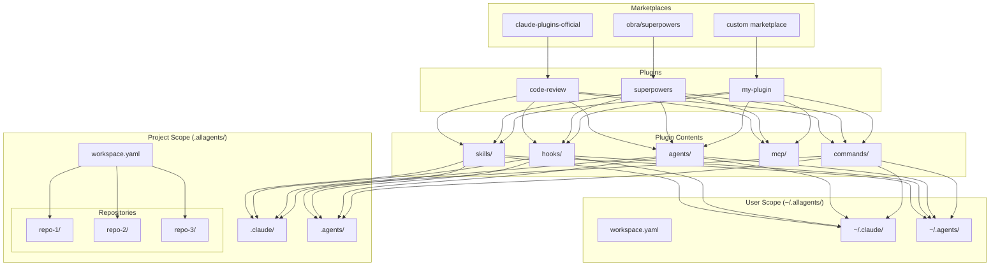

**AllAgents** is a CLI tool for managing AI coding assistant plugins across multiple clients like Claude Code, GitHub Copilot, Cursor, and more.

## The Problem

AI coding assistants (Claude, Copilot, Cursor, Codex, etc.) each have their own configuration formats and directory structures. If you want to share skills across multiple projects or use multiple AI clients, you need to manually copy and transform files.

## The Solution

AllAgents solves this by providing:

| Feature | Claude Code Plugins | AllAgents |
|---------|--------------------|-----------|
| Scope | Single project | Multi-repo workspace |
| Client support | Claude only | 8 AI clients |
| File location | Runtime lookup from cache | Copied to workspace (git-versioned) |
| Project structure | AI config mixed with code | Separate workspace repo |

## Architecture

**Key concepts:**

| Concept | Description |
|---------|-------------|
| **Marketplace** | Registry of available plugins (GitHub repo with manifest) |
| **Plugin** | Package containing skills, hooks, agents, MCP servers, and commands |
| **User Scope** | Plugins installed to `~/.allagents/` available across all projects |
| **Project Scope** | Plugins installed to `.allagents/` for a specific workspace |
| **Workspace** | Configuration linking multiple repositories with shared plugins |

## Next Steps

- [Installation](/getting-started/installation/) - Install AllAgents
- [Quick Start](/getting-started/quick-start/) - Create your first workspace
